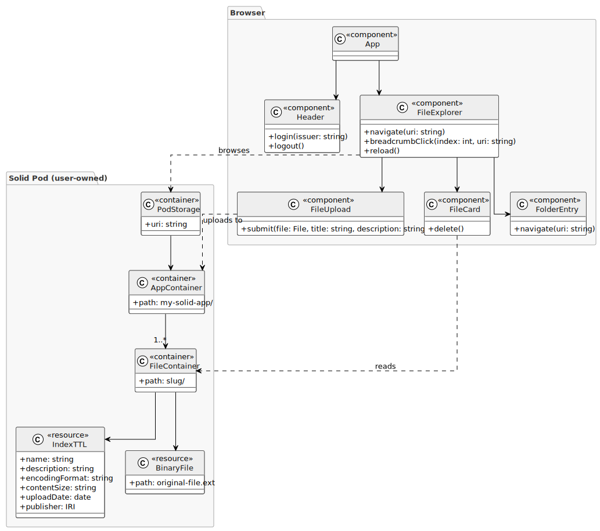

# solid.drive

solid.drive is a file manager built on the [Solid Protocol](https://solidproject.org/). Every file is stored directly in the user's own Solid Pod — the server never holds a copy of the data.

Each uploaded file is assigned a semantic class drawn from the [schema.org](https://schema.org/) vocabulary (Image, Video, Audio, Document, Spreadsheet, or general File). This makes the data discoverable and consumable by other Solid-compatible applications without requiring access to this app.

## Architecture

<details>
<summary>View architecture diagram</summary>



</details>

Regenerate with:
```bash
java -jar plantuml.jar -tsvg docs/architecture.puml
```

## Features

- **Authentication**: logs in via any OIDC-compliant Solid identity provider (`solidcommunity.net`, `inrupt.net`, `solidweb.org`, or a self-hosted server)
- **Pod navigation**: browse the full Pod directory tree with breadcrumb navigation
- **File adoption**: renders files that existed on the Pod before the app was used, showing folder name and download button for containers lacking `index.ttl`
- **File upload**: accepts any file type; stores the binary and a metadata document (`index.ttl`) inside a dedicated container on the Pod
- **Semantic classification**: MIME type is mapped to a schema.org class (`schema:ImageObject`, `schema:VideoObject`, `schema:AudioObject`, `schema:TextDigitalDocument`, `schema:SpreadsheetDigitalDocument`, or `schema:DigitalDocument`) and written to `index.ttl` as `rdf:type`
- **Inline preview**: images render as ``, videos as `<video>`, audio as `<audio>`, PDFs and text files as `<iframe>`, all from a local blob URL — no request leaves the browser after the file is fetched
- **Download**: triggers a browser-native download from the blob URL, not a redirect to the Pod server
- **File info**: a toggle on each file card shows: type, title, description, MIME type, size, upload date, and publisher name (resolved from their Solid profile); all metadata read from `index.ttl`
- **Profile-first catalog**: `dcat:catalog` is read from the user's WebID profile first, falling back to `${storageRoot}catalog.ttl`. Users who bring their own catalog from another app will have it recognized automatically
- **Catalog management**: `catalog.ttl` is updated on every upload and cleaned up on every delete using SPARQL PATCH, so the full list of files and their classes is always queryable without scanning Pod containers
- **Delete**: removes the binary, `index.ttl`, the container, and the entry in `catalog.ttl` in the correct order so no orphaned resources remain

## Tech Stack

| Layer | Technologies |
|---|---|
| Frontend | React 19 · TypeScript · Vite |
| Solid / Linked Data | [@ldo/solid](https://github.com/o-development/ldo) · @ldo/solid-react · ShEx · schema.org · DCAT |
| Deployment | Docker · nginx |

## Getting Started

### Prerequisites

- **Node.js** ≥ 18 — [nodejs.org](https://nodejs.org/)
- **npm** — bundled with Node.js

### Install dependencies

```bash
npm install
```

### Start the development server

```bash
npm run dev
```

### Build for production

```bash
npm run build
```

## Docker

```bash
docker run -p 3000:80 solid-hello-world-frontend-react
```

## Project Structure

```
solid.drive/
├── src/
│   ├── .shapes/       # ShEx shape definitions
│   ├── .ldo/          # Auto-generated LDO bindings (never edit directly)
│   └── ...            # Components and modules — see src/README.md
├── tests/             # Unit tests
├── docs/              # Architecture diagrams
├── Dockerfile
├── nginx.conf
└── vite.config.ts
```

For component and module details see [src/README.md](src/README.md).
For shape definitions see [src/.shapes/README.md](src/.shapes/README.md).
