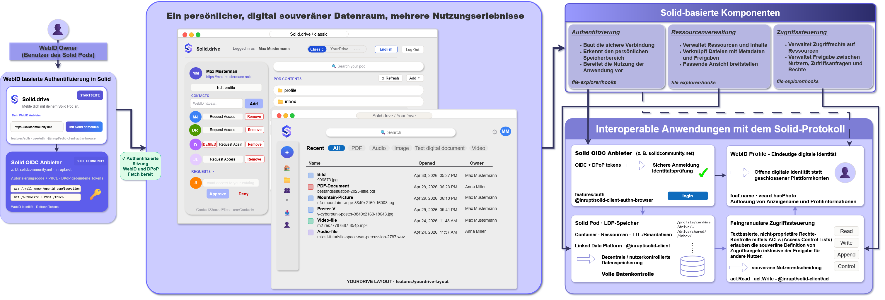

= Poster

This Project will be presented at the *LSWT 2026* (Leipziger Semantic Web Tag) on June 3, 2026. The poster summarises the motivation, data model, architecture, technical evaluation, and outlook of this project.

== Files

link:Solid.drive-LSWT-Poster-Parnian-Hajian-Pro.Andreas-Both-2026.06.03.pdf[Poster (PDF)]::
Final A0 poster covering motivation, data model, architecture, technical evaluation, and outlook.

link:https://drive.google.com/file/d/1TfsPdSC4kcF2YTzLRjLwyP2GADRSWqEz/view?usp=sharing[Architecture diagram (Google Drive)]::
Full resolution architecture and workflow diagram, hosted on Google Drive.

.Architecture and workflow diagram

link:https://1drv.ms/p/c/5ccb93723a03401c/IQD2azLQ-ItwRYN4CPaf2a1nAWYdg-o1XSkL2jCcLXxk_6o?e=v59sHF[PowerPoint deck]::
Slide deck used to lay out the poster, hosted on OneDrive.

== Navigation

.Parent
link:../README.adoc[docs]
