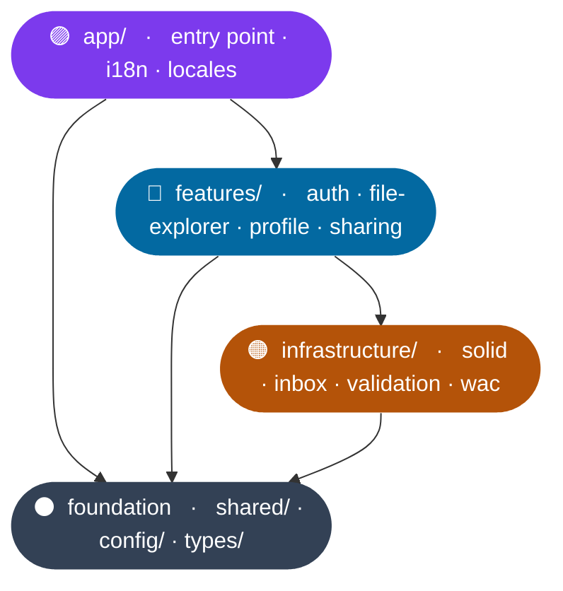

# src

## Overview

The entire application lives here. The structure follows a layered architecture. Features depend on infrastructure, and both may use shared. Infrastructure never imports from features.

## Architecture

**Key rule:** `infrastructure/` never imports from `features/`. The only cross-feature dependency is `file-explorer` → `features/sharing/hooks/useAclManager`.

## Contents

| Name | Description |
|---|---|
| **app/** | Entry point, i18n setup, and locale files |
| **config/** | Constants and environment variables (single source of truth) |
| **features/** | UI features grouped by domain (`auth`, `file-explorer`, `profile`, `sharing`) |
| **infrastructure/** | Service layer: Solid protocol, RDF utilities, inbox, validation, WAC |
| **shared/** | Reusable components, contexts, and utilities used across features |
| **types/** | Shared TypeScript types |
| **.ldo/** | Auto-generated LDO typed data objects (do not edit by hand) |
| **.shapes/** | ShEx shape files used to generate the LDO types |
