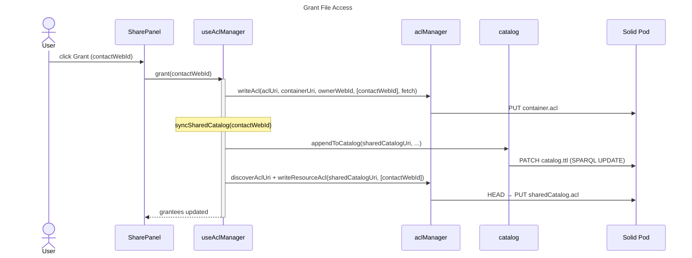

# Share Panel

## Overview

Manage per-file access sharing from within a `FileCard`. Loads the file container's WAC ACL to discover current grantees, then lets the owner grant or revoke access for contacts from their profile.

## Features

| Action | Description |
|---|---|
| Grant | Updates the container ACL, writes the file metadata into a per-contact shared catalog, and secures that catalog with its own ACL so only the intended contact can read it |
| Revoke | Removes the contact from the container ACL and deletes the mirrored entry from their shared catalog |

## Hooks

| Hook | Purpose |
|---|---|
| `useAclManager` | Reads the container ACL, exposes current grantees, and handles grant / revoke operations including shared catalog sync |

## Sequence

