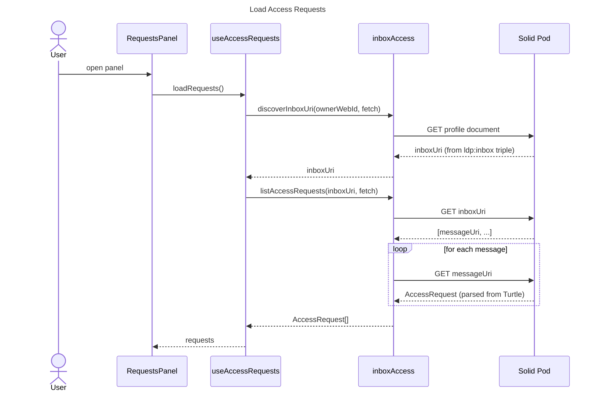

# Requests Panel

## Overview

Collapsible panel for managing incoming access requests. Loads pending requests from the user's LDP inbox on open.

## Features

| Feature | Description |
|---|---|
| Approve (catalog) | Creates a per-viewer shared catalog, grants read access to it, the main catalog, and the app container. Deletes the inbox message on success |
| Approve (file) | Grants the requester read access to the specific file container. Deletes the inbox message on success |
| Deny | Sends a rejection notification to the requester's inbox, then deletes the message |
| Badge | Shows the count of pending requests on the toggle button |
| Requester profile | Each row shows the requester's avatar and display name via `RequesterRow` |

## Hooks

| Hook | Purpose |
|---|---|
| `useAccessRequests` | Loads inbox requests, tracks busy state, and handles approve/deny actions |

## Sequence

