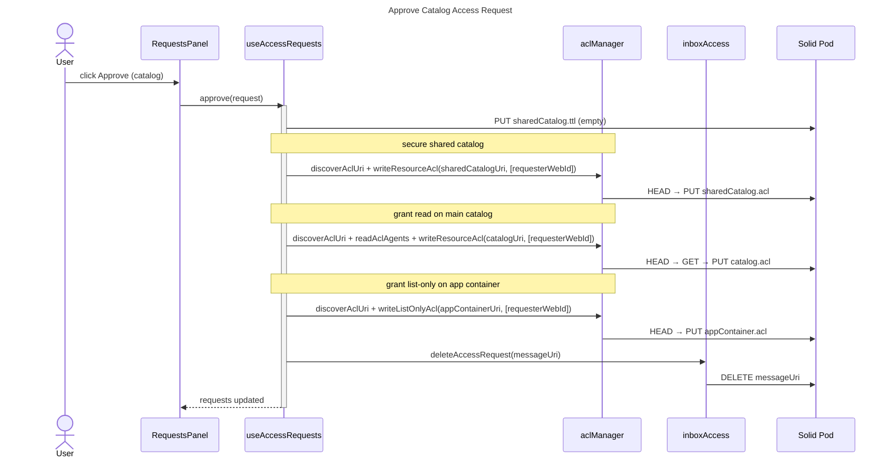
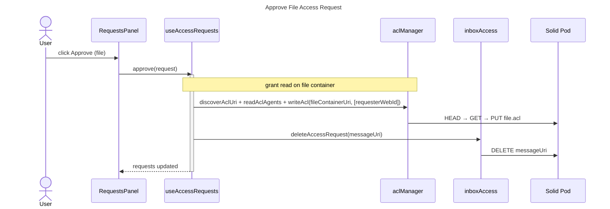

# Access Requests

## Overview

Lists, approves, and denies access requests from the user's LDP inbox. Loads requests on mount and on manual refresh.

## Actions

| Action | Description |
|---|---|
| Catalog approval | Creates a shared catalog, grants read access to it, the main catalog, and the app container listing |
| File approval | Grants read access directly to the file container |
| Denial | Sends a rejection notification to the requester's inbox before removing the message |

## Returns

| Field | Description |
|---|---|
| `requests` | Current list of access requests |
| `loading` | Boolean loading state |
| `error` | Error message or null |
| `busyMessageUri` | URI of the message currently being processed |
| `loadRequests` | Function to manually refresh the request list |
| `approve` | Function to approve a request |
| `deny` | Function to deny a request |

## Approve catalog request

## Approve file request

